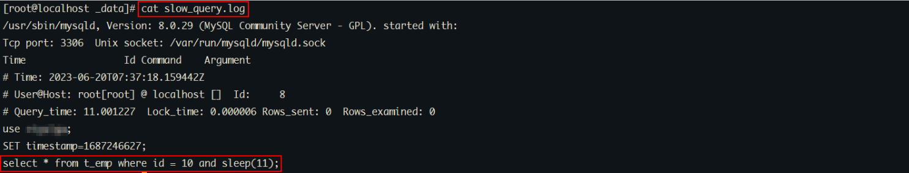

# MySQL基础日志
## 1.1 日志分类

在任何一种数据库中，都会有各种各样的日志，记录着数据库工作的方方面面，以帮助数据库管理员追踪数据库曾经发生过的各种事件。MySQL有多种类型的日志，用于记录数据库的操作和状态。以下是一些常见的MySQL日志：

1、错误日志（Error Log）：记录MySQL服务器在启动、运行过程中发生的错误和异常情况，如启动错误、语法错误等。

```sh
默认错误日志的位置：/var/lib/mysql
自定义位置：修改配置文件，在配置文件中指定。
```


2、查询日志（Query Log）：记录所有执行的查询语句，包括SELECT、INSERT、UPDATE、DELETE等操作。可以用于分析查询性能和调试问题，但需要注意对于高负载的系统，开启查询日志可能会对性能产生影响。

```
查询错误日志的位置：/var/lib/mysql
自定义位置：修改配置文件，在配置文件中指定。
```


3、慢查询日志（Slow Query Log）：记录执行时间超过指定阈值的查询语句。慢查询日志可以帮助你找出执行时间较长的查询，以便进行性能优化。

```
慢查询日志的位置：/var/lib/mysql
自定义位置：修改配置文件，在配置文件中指定。
```


4、二进制日志（Binary Log）：记录所有对数据库的更改操作，包括数据修改、表结构变更等。二进制日志可以用于数据恢复、主从复制等场景。


5、事务日志（Transaction Log）：也称为重做日志（Redo Log），记录正在进行的事务的更改操作。事务日志用于保证数据库的ACID特性，并支持崩溃恢复。


## 1.2 慢查询日志

慢查询日志记录了所有执行时间超过参数 long_query_time 设置值，long_query_time 默认为 10 秒，最小为 0， 精度可以到微秒。

### 1.2.1 日志参数配置

默认情况下，MySQL数据库没有开启慢查询日志，需要我们手动来设置这个参数。当然，如果不是调优需要的话，一般不建议启动该参数，因为开启慢查询日志会或多或少带来一定的性能影响。

慢查询日志默认是关闭的 。可以通过两个参数来控制慢查询日志 ：

```shell
# 该参数用来控制慢查询日志是否开启， 可取值： 1 和 0 ， 1 代表开启， 0 代表关闭
SET GLOBAL slow_query_log=1; 


# 该选项用来配置查询的时间限制， 超过这个时间将认为值慢查询， 将需要进行日志记录， 默认10s
SET long_query_time =0.1;
```

重启mysql进行测试。

### 1.2.2 日志内容读取

和错误日志、查询日志一样，慢查询日志记录的格式也是纯文本，可以被直接读取。

1、查询慢查询是否开启以及日志文件位置

```sql
SHOW VARIABLES LIKE '%slow_query_log%'; 
```

2、查询long_query_time 的值。

```sql
SHOW VARIABLES LIKE '%long_query_time%'; -- 查看值：默认10秒
```

3、执行查询操作

```sql
 select * from t_emp ;
```

由于在查询的执行时间小于10s，因此该查询不会记录到慢查询日志中。


模拟慢查询效果：

```sql
 select * from t_emp where id = 10 and sleep(11) ;   -- 使用SLEEP函数可以让查询暂停指定的时间
```


查看慢查询日志内容：



> 正常业务的sql语句都要求在200-500ms之间。
>
> 特殊的业务（数据备份和恢复）sql语句的时间就可以调整的高一些。10s种----【100-200w】


**mysqldumpslow：**

在生产环境中，如果要手工分析日志，查找、分析SQL，显然是个体力活，MySQL提供了日志分析工具mysqldumpslow。


**注意**默认情况下，传统rpm方式（5.7）安装的MySQL环境自带mysqldumpslow工具，直接使用即可。docker下安装的MySQL环境没有mysqldumpslow工具。


> 如果是使用rp方式安装就不需要。

退出mysql命令行，执行以下命令：

```sql
-- 查看mysqldumpslow的帮助信息
mysqldumpslow --help

-- 工作常用参考
-- 1.得到返回记录集最多的10个SQL
mysqldumpslow -s r -t 10 /var/lib/mysql/bugfe-slow.log
-- 2.得到访问次数最多的10个SQL
mysqldumpslow -s c -t 10 /var/lib/mysql/bugfe-slow.log
-- 3.得到按照时间排序的前10条里面含有左连接的查询语句
mysqldumpslow -s t -t 10 -g "left join" /var/lib/mysql/bugfe-slow.log
-- 4.另外建议在使用这些命令时结合 | 和more 使用 ，否则语句过多有可能出现爆屏情况
mysqldumpslow -s r -t 10 /var/lib/mysql/bugfe-slow.log | more
```

- -a: 不将数字抽象成N，字符串抽象成S
- -s: 是表示按照何种方式排序；
    - c: sql语句的访问次数
    - l: 锁定时间
    - r: 返回数据记录集的总数量
    - t: 查询时间
    - al:平均锁定时间
    - ar:平均返回记录数
    - at:平均查询时间
- -t: 即为返回前面多少条的数据；
- -g: 后边搭配一个正则匹配模式，大小写不敏感的；