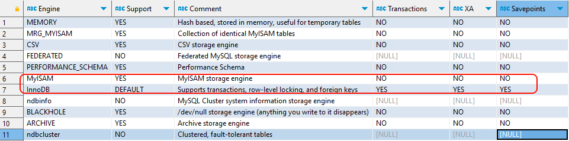

# MySQL升级打怪中...
## 3 存储引擎
在MySQL8中提供了很多的存储引擎，不同的存储引擎的特点是不一样的，常见的存储引擎有：**InnoDB**、**MyISAM**、Memory、Archive(高压缩比)、Blackhole（黑洞）、CSV引擎、Federated引擎等。
### 3.1 **查看存储引擎**
***
查看MySQL提供什么存储引擎

**SHOW ENGINES;**

查看MySQL提供什么存储引擎
```sql
SHOW ENGINES;
```

下面的结果表示MySQL中默认使用的存储引擎是InnoDB，支持事务，行锁，外键等。



也可以通过以下语句查看默认的存储引擎：

```sql
SHOW VARIABLES LIKE '%default_storage_engine%';
```


### 3.2 **主要的存储引擎介绍**
***
#### 3.2.1 **InnoDB**
##### **特点介绍**
1、默认存储引擎：在MySQL 5.5版本之后，InnoDB成为了MySQL的默认存储引擎。
2、支持事务：InnoDB是一个支持ACID事务的存储引擎，可以提供数据的一致性和可靠性。
3、行级锁定：InnoDB使用行级锁定来实现并发控制，允许多个事务同时读取和写入不同的行，提高了并发性能。
4、外键约束：InnoDB支持外键约束.
5、支持崩溃恢复：InnoDB具有崩溃恢复机制，可以在数据库异常关闭后进行恢复。

#### 3.2.2 **MyISAM**
##### **特点介绍**

1、不支持事务：MyISAM是一个不支持事务的存储引擎，无法提供数据的一致性和可靠性。
2、表级锁定：MyISAM使用表级锁定来实现并发控制，只允许一个事务对整个表进行读写操作，限制了并发性能。
3、较低的存储空间占用：相比InnoDB，MyISAM在存储空间占用方面较低，适合存储大量非事务性的数据。

#### 3.2.3 **MyISAM和InnoDB的对比**
| **对比项**             |                         **MyISAM**                          |                          **InnoDB**                          |
| ---------------------- | :---------------------------------------------------------: | :----------------------------------------------------------: |
| 外键                   |                           不支持                            |                             支持                             |
| 事务                   |                           不支持                            |                             支持                             |
| XA                     |                           不支持                            |                             支持                             |
| 行表锁                 |  表锁，即使修改一条记录也会锁住整个表，不适合高并发的操作   |  行锁,修改时只锁某一行，不对其它行有影响，适合高并发的操作   |
| savePoint              |                           不支持                            |                             支持                             |
| 文件类型               | **.myd**、**.myi**、<strong style="color:red">.frm</strong> |      **.ibd**、<strong style="color:red">.frm</strong>       |
| 缓存（5.7）            |                 只缓存索引，不缓存真实数据                  | 不仅缓存索引还要缓存真实数据，对内存要求较高，而且内存大小对性能有决定性的影响 |
| 聚簇（主键）索引       |                           不支持                            |                             支持                             |
| 默认使用               |                              N                              |                              Y                               |
| count(*)/不带where条件 |                             快                              |                              慢                              |
| 使用场景               |  不需要事务支持、并发相对较低、数据相对修改较少、以读为主   |        需要事务支持、并发相对较高、数据更新较为频繁。        |

.frm在mysql8中移除掉了，存储的是库或表的结构。
InnoDB中的 **.ibd** 存储的是数据和索引。而**MyISAM**中 **.myd** 存的是数据、**.myi**存的是索引。

```sql
select count(*)  from user;---若查询记录数时带了条件，那么MyIsam更快一些。
select count(*)  from  user where age=18;----若查询记录数时带了条件，那么一样快。
```

## 4 MySQL索引入门
### 4.1 索引概述
***
MySQL官方对索引的定义为：索引（index）是帮助MySQL高效获取数据的**数据结构**（有序）。在数据之外，数据库系统还维护者满足特定查找算法的数据结构，这些数据结构以某种方式引用（指向）数据， 这样就可以在这些数据结构上实现高级查找算法，这种数据结构就是索引。如下面的示意。

> 【5,10，2,1,6,8】------id=8
>
> 排序
>
> 【1,2,5,6,8,10】----算法（折半）
>
>
>
> id     name      age;（普通索引、唯一索引）---age建立索引---在底层要给age的这些值排序
>
> 1     ‘ls’     10
>
> 2     ‘zs’     8
>
> 3     ‘ww’     11
>
> 4     ‘zl’     1
>
> age(索引): 1 8 10 11


>利用二叉查找树（排序）树，既能有顺序的将那些无序的元素，变为有序，而且还自带了一种折半的思想算法在里面。因此这用树作为索引结构而不去用数组+算法作为所以会更加的方便。


左边是数据表，一共有两列七条记录，最左边的是数据记录的物理地址（注意逻辑上相邻的记录在磁盘上也并不是一定物理相邻的）。为了加快Col2的查找，可以维护一个右边所示的二叉查找树，每个节点分别包含索引键值和一个指向对应数据记录物理地址的指针，这样就可以运用二叉查找快速获取到相应数据。一般来说索引本身也很大，不可能全部存储在内存中，因此索引往往以索引文件的形式**存储在磁盘上**。索引是数据库中用来提高性能的最常用的优化手段。

### 4.2 优点和缺点
***
优势</strong>

1）**降低了Io次数：** 类似于书籍的目录索引，提高数据检索的效率，降低数据库的IO成本。

2） **降低了cpu的消耗**：通过索引列对数据进行排序，降低数据自己排序的成本，进一步能降低CPU的消耗。

<strong style='color:red'>劣势</strong>

1）**空间利用率**： 实际上索引也是一张表，该表中保存了主键与索引字段，并指向实体类的记录，所以**索引列也是要占用空间**的。

2） **时间利用率**：虽然索引大大提高了查询效率，同时却也**降低更新表的速度**，如对表进行INSERT、UPDATE、DELETE。因为更新表时，MySQL 不仅要更新数据，还要更行一下索引文件。

## MySQL索引结构
### 5.1 MySQL索引结构
***
索引结构是指在数据库中用于**组织和管理索引的数据结构**。索引结构的设计和实现对于数据库的性能和效率具有重要影响。

常见的索引结构包括：

1、**B树(B-tree):** B树是一种平衡的**多路搜索树**，被广泛应用于数据库系统中。B树的特点是每个节点可以存储多个键值，并且保持有序。B树的高度相对较低，可以快速定位到目标数据。

2、**B+树(B+tree):** B树是一种平衡的**多路搜索树**，被广泛应用于数据库系统中。B+树的特点是**每个节点可以比B树还存储更多的键值**，并且保持有序。初次之外B+树的**高度相对B树更低**，因此查询数据的Io次数就更少，查询效率就更高。

2、**Hash索引**（Hash Index）：Hash索引使用哈希函数将索引列的值映射为一个固定长度的哈希码，并将哈希码作为索引的键值。Hash索引适用于等值查询，可以快速定位到目标数据。**BUT**，Hash索引不支持<strong style='color:red'>范围查询和排序</strong>操作。

3、R树（R-tree）：R树是一种用于处理多维数据的索引结构，常用于地理信息系统（GIS）和空间数据库中。R树可以高效地支持范围查询和最近邻查询。

4、Full-text （全文索引） ：全文索引也是MyISAM的一个特殊索引类型，主要用于全文索引，InnoDB从Mysql5.6版本开始支持全文索引。


MyISAM、InnoDB、Memory三种存储引擎对各种索引类型的支持

| 索引        | InnoDB引擎      | MyISAM引擎 | Memory引擎 |
| ----------- | --------------- | ---------- | ---------- |
| BTREE索引   | 支持            | 支持       | 支持       |
| HASH 索引   | 不支持          | 不支持     | 支持       |
| R-tree 索引 | 不支持          | 支持       | 不支持     |
| Full-text   | 5.6版本之后支持 | 支持       | 不支持     |


而我们平常所说的索引，如果没有特别指明，都是指**B+树**（多路搜索树，注意：并不一定是二叉的）结构组织的索引。

[//]: # (### 5.2 索引结构-树)

[//]: # (***)

[//]: # (#### 5.2.1 二叉树)

[//]: # (**二叉树**)

[//]: # ()
[//]: # (树有很多种，**每个节点最多只能有两个子节点**的一种形式称为二叉树。二叉树的子节点分为左节点和右节点。)

[//]: # ()
[//]: # (![二叉树]&#40;img/二叉树.png&#41;)

[//]: # ()
[//]: # (**二叉查找树（BST）**)

[//]: # ()
[//]: # (BST&#40;Binary Sort&#40;Search&#41; Tree&#41;：对于二叉排序树的任何一个非叶子节点，要求左子节点的值比当前节点的值小，右子节点的值比当前节点的值大。)

[//]: # (特别说明：如果有相同的值，可以将该节点放在左子节点或右子节点。)