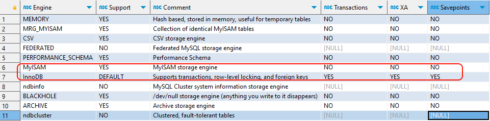

## 3 存储引擎
***
在MySQL8中提供了很多的存储引擎，不同的存储引擎的特点是不一样的，常见的存储引擎有：**InnoDB**、**MyISAM**、Memory、Archive(高压缩比)、Blackhole（黑洞）、CSV引擎、Federated引擎等。
### 3.1 查看存储引擎
***
查看MySQL提供什么存储引擎

**SHOW ENGINES;**

查看MySQL提供什么存储引擎
```sql
SHOW ENGINES;
```
下面的结果表示MySQL中默认使用的存储引擎是InnoDB，支持事务，行锁，外键等。

也可以通过以下语句查看默认的存储引擎：
```sql
SHOW VARIABLES LIKE '%default_storage_engine%';
```


### 3.2 主要的存储引擎介绍
***
#### 3.2.1 InnoDB
##### 特点介绍
1、默认存储引擎：在MySQL 5.5版本之后，InnoDB成为了MySQL的默认存储引擎。
2、支持事务：InnoDB是一个支持ACID事务的存储引擎，可以提供数据的一致性和可靠性。
3、行级锁定：InnoDB使用行级锁定来实现并发控制，允许多个事务同时读取和写入不同的行，提高了并发性能。
4、外键约束：InnoDB支持外键约束.
5、支持崩溃恢复：InnoDB具有崩溃恢复机制，可以在数据库异常关闭后进行恢复。

#### 3.2.2 MyISAM
##### 特点介绍

1、不支持事务：MyISAM是一个不支持事务的存储引擎，无法提供数据的一致性和可靠性。
2、表级锁定：MyISAM使用表级锁定来实现并发控制，只允许一个事务对整个表进行读写操作，限制了并发性能。
3、较低的存储空间占用：相比InnoDB，MyISAM在存储空间占用方面较低，适合存储大量非事务性的数据。

#### 3.2.3 MyISAM和InnoDB的对比
| **对比项**             |                         **MyISAM**                          |                          **InnoDB**                          |
| ---------------------- | :---------------------------------------------------------: | :----------------------------------------------------------: |
| 外键                   |                           不支持                            |                             支持                             |
| 事务                   |                           不支持                            |                             支持                             |
| XA                     |                           不支持                            |                             支持                             |
| 行表锁                 |  表锁，即使修改一条记录也会锁住整个表，不适合高并发的操作   |  行锁,修改时只锁某一行，不对其它行有影响，适合高并发的操作   |
| savePoint              |                           不支持                            |                             支持                             |
| 文件类型               | **.myd**、**.myi**、<strong style="color:red">.frm</strong> |      **.ibd**、<strong style="color:red">.frm</strong>       |
| 缓存（5.7）            |                 只缓存索引，不缓存真实数据                  | 不仅缓存索引还要缓存真实数据，对内存要求较高，而且内存大小对性能有决定性的影响 |
| 聚簇（主键）索引       |                           不支持                            |                             支持                             |
| 默认使用               |                              N                              |                              Y                               |
| count(*)/不带where条件 |                             快                              |                              慢                              |
| 使用场景               |  不需要事务支持、并发相对较低、数据相对修改较少、以读为主   |        需要事务支持、并发相对较高、数据更新较为频繁。        |
```sql
select count(*)  from user;---若查询记录数时带了条件，那么MyIsam更快一些。
select count(*)  from  user where age=18;----若查询记录数时带了条件，那么一样快。
```
