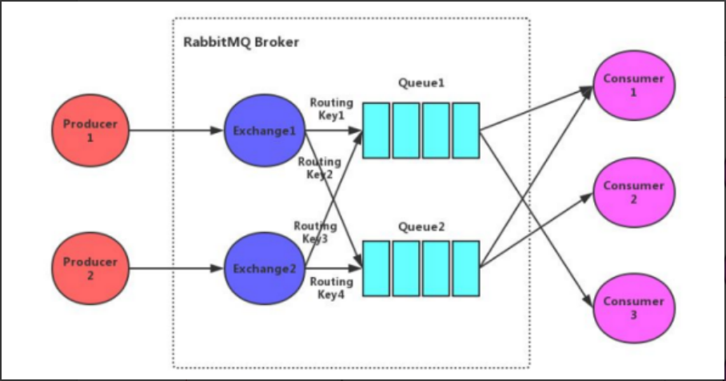

# 简述RabbitMQ的架构设计

**Broker**：rabbitmq的服务节点 

**Queue**：队列，是RabbitMQ的内部对象，用于存储消息。RabbitMQ中消息只能存储在队列中。生产者投 

递消息到队列，消费者从队列中获取消息并消费。多个消费者可以订阅同一个队列，这时队列中的消息 

会被平均分摊(轮询)给多个消费者进行消费，而不是每个消费者都收到所有的消息进行消费。(注意： 

RabbitMQ不支持队列层面的广播消费，如果需要广播消费，可以采用一个交换器通过路由Key绑定多个队 

列，由多个消费者来订阅这些队列的方式。 

**Exchange**：交换器。生产者将消息发送到Exchange，由交换器将消息路由到一个或多个队列中。如果路 

由不到，或返回给生产者，或直接丢弃，或做其它处理。 

**RoutingKey**：路由Key。生产者将消息发送给交换器的时候，一般会指定一个RoutingKey，用来指定这个 

消息的路由规则。这个路由Key需要与交换器类型和绑定键(BindingKey)联合使用才能最终生效。在交换 

器类型和绑定键固定的情况下，生产者可以在发送消息给交换器时通过指定。RoutingKey来决定消息流向 

哪里。 

**Binding**：通过绑定将交换器和队列关联起来，在绑定的时候一般会指定一个绑定键，这样RabbitMQ就可 

以指定如何正确的路由到队列了。 

交换器和队列实际上是多对多关系。就像关系数据库中的两张表。他们通过BindingKey做关联(多对多关 

系表)。在投递消息时，可以通过Exchange和RoutingKey(对应BindingKey)就可以找到相对应的队列。 

**信道**：信道是建立在Connection 之上的虚拟连接。当应用程序与Rabbit Broker建立TCP连接的时候，客户 

端紧接着可以创建一个AMQP 信道(Channel) ，每个信道都会被指派一个唯一的ID。RabbitMQ 处理的每条 

AMQP 指令都是通过信道完成的。信道就像电缆里的光纤束。一条电缆内含有许多光纤束，允许所有的连 

接通过多条光线束进行传输和接收。